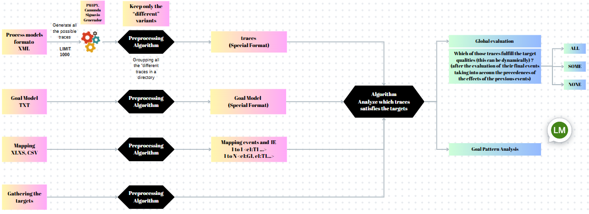

# Traces-driven Goals Analysis

# 

## Code Components - Description

I developed a Goals-driven trace analysis application to analyze and evaluate the satisfaction of goals and qualities based on process models executions. My application takes a BPMN model in XML format as input to generate traces, along with a goal model in text format that defines the goals, tasks, and qualities associated with the process. Target elements and mappings are also given by the user to guide the analysis.

The components of my application are:

1. `bpmn_processor.py`: This file provides the process_bpmn_file function which
processes a BPMN file, converts it to a Petri net, generates traces, and returns the unique traces found in the model. It uses the PM4Py library for BPMN processing and trace generation. This is the first step in the application logic, where the BPMN model is processed to obtain the traces.
2. `istar_processor.py`: This file contains the process_istar_model function which processes an iStar goal model file in JSON format and generates the corresponding demo_model.py file with the goal model setup code. It extracts tasks, goals, qualities, links, and requirements from the iStar model. The iStar model is processed after obtaining the traces from the BPMN model.
3. `goal_model.py`: This file defines the core GoalModel class which represents the structure and behavior of the goal model. It includes methods for adding tasks, goals, qualities, links, and event mappings, as well as processing events and updating the model state based on the defined logic and propagation rules. The goal model is created based on the processed iStar model.
4. `demo_model.py`: This file contains the create_model function which sets up a specific instance of the goal model with predefined tasks, goals, qualities, links, requirements, and event mappings. It is used as a demo or example model for testing and demonstration purposes. This file is generated or updated based on the processed iStar model.
5. `mapping_updater.py`: This file provides the update_event_mappings function which processes an Excel or CSV file containing event-task mappings and updates the demo_model.py file with the new mappings. It allows for easy updating of the mappings without manually modifying the code. The mappings are updated after creating the goal model.
6. `run_analysis.py`: This file is the entry point for running the trace analysis. It creates an instance of the TraceAnalyzer class, passes the traces and target elements to analyze, and prints the analysis results. The targets are received in this file, and the trace analysis is initiated.
7. `trace_analyzer.py`: This file contains the analyze_traces function which analyzes each trace against the target elements using the goal model. It creates a model for each trace, processes the events, checks the satisfaction of target elements, and stores the results. The trace analysis is performed based on the received targets.
8. `goal_pattern_analyzer.py`: This file provides the analyze_goal_patterns function which analyzes the satisfaction rates of goals and qualities across multiple traces. It creates a fresh model for each trace, processes the events, and collects statistics on the final state of goals and qualities. The goal pattern analysis is performed after the trace analysis.
9. `enums.py`: This file defines the enumeration classes ElementStatus, LinkType, and LinkStatus which are used throughout the application to represent the possible states and types of elements and links in the goal model. These enums are used in various parts of the application.
10. `run.py`: This file is responsible for creating and displaying the interactive user interface for the goal model. It creates an instance of the InteractiveGoalModel class from interactive_ui.py. The interactive UI is used to visualize and interact with the goal model.
11. `interactive_ui.py`: This file defines the InteractiveGoalModel class which creates the interactive widgets, displays the goal model state, and handles user interactions such as processing events and resetting the model. It uses the create_model function from demo_model.py to initialize the goal model. This file provides the functionality for the interactive UI.

I made certain assumptions while developing this application:
1. I assume that the input BPMN model in XML format is well-formed and follows the expected structure.
2. The goal model provided in text format is assumed to have a specific structure and syntax, as defined in my `goal_model.py` file. That means that only contains the components defined there (Tasks, Goals, Qualities, refinement links of AND/OR type, and contributions links type MAKE/BREAK)
3. I assume that the target elements and mappings are correctly specified and align with the elements defined in the goal model.
4. I also assume that the traces generated from the BPMN model are valid (This is reviewed by the PM4PY library= and represent feasible execution paths.

However, my application has some limitations:
1. It relies on the accuracy and completeness of the input BPMN model and goal model. Any errors or inconsistencies in these models may affect the analysis results.
2. My application does not handle complex branching or parallel execution paths in the traces or loops. It assumes a linear execution flow.
3. The analysis results are based on the provided traces and may not cover all possible scenarios or edge cases. For instance, the application does not consider invalid traces.

## Evaluation Algorithm - Description

1. Initial State Initialization
   - All system elements (tasks, goals, qualities) start in an "Unknown" status
   - The system prepares to process events sequentially

2. Event Processing Workflow
   - The algorithm processes events one at a time, chronologically
   - Each event triggers a series of systematic evaluations and status updates

#### Forward Propagation
- When an event occurs, its associated task is activated
- The system examines links connected to the activated task
- Link types (OR, AND) determine how goals and other elements are updated
- Goals can be:
  - Achieved (all requirements met)
  - Partially Achieved (some requirements met)
  - Unknown (no requirements met)

#### Backward Propagation
- After forward propagation, the system checks for potential conflicts
- Quality elements can be:
  - Fulfilled (goal successfully completed)
  - Denied (goal blocked or contradicted)
- Deactivation can cascade through interconnected elements

### Link Type Dynamics

1. OR Links
   - Activation requires only one condition to be met
   - Provides flexibility in goal achievement

2. AND Links
   - Activation requires all specified conditions to be met
   - Ensures comprehensive requirement satisfaction

3. MAKE/BREAK Links
   - Influence quality statuses
   - Can promote or prevent goal progression

### Key Principles

- Systematic Event Processing: Events are evaluated sequentially
- Dynamic Status Tracking: Continuous update of element statuses
- Interdependency Management: Complex relationships between tasks, goals, and qualities
- Conflict Resolution: Mechanisms to handle contradictory or competing requirements

