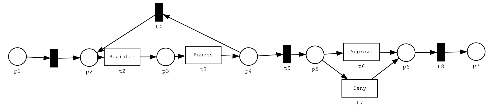
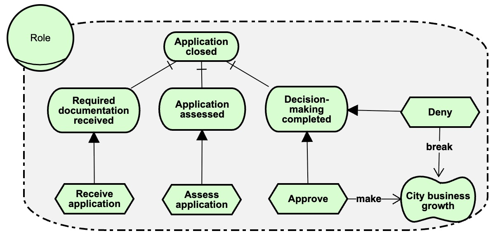
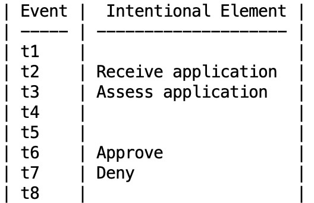
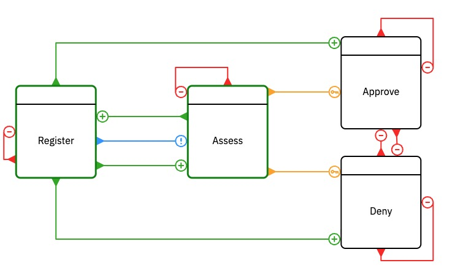
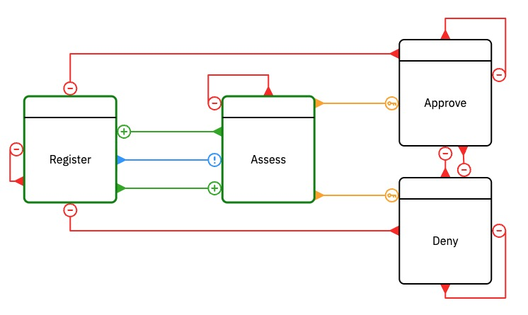

## Required imports

```python
from Semantics.istar_processor import read_istar_model
from Semantics.petri_net_processor import read_petri_net
from Semantics.event_mapping_from_csv import read_event_mapping_csv, event_mapping_for_petri_net
from Ui.interface import InterfaceBuilder
from Ui.interface import WhatIfInterfaceBuilder
from Semantics.transition_system import combine_goal_model_and_petri_net
from Semantics.transition_system import CombinedTransitionSystem
from scripts.sanitize_pnml import sanitize
```

## Running Example


Petri Net




Goal Model




Event Mapping




### Non-Interactice

```python
goal_model = read_istar_model("Data/example/goal_model.txt")
print("Events "+str(goal_model.all_events()))

petri_net = read_petri_net("Data/example/petri_net.pnml")
print("Transitions in Petri Net: "+repr(petri_net.net.transitions))

event_mapping = read_event_mapping_csv("Data/example/map.csv")
print(event_mapping)

lts_gm = goal_model.as_transition_system()
print(f"Goal Model LTS reachable states and transitions: {lts_gm.size()}")

lts_pn = petri_net.as_transition_system()
print(f"Petri Net LTS reachable states and transitions: {lts_pn.size()}")

lts_combined = CombinedTransitionSystem(lts_gm, lts_pn, event_mapping)
print(f"Combined LTS reachable states and transitions: {lts_combined.size()}")

results = lts_combined.check_stability(goal_model.qualities)
print(f"Stability: {results}")

result = lts_combined.check_weak_compliance(goal_model.qualities)
print(f"Weak Compliance: {result}")

```

### Interactive

```python
goal_model = read_istar_model("Data/example/goal_model.txt")
petri_net = read_petri_net("Data/example/petri_net.pnml")
event_mapping = read_event_mapping_csv("Data/example/map.csv")

interface = InterfaceBuilder(goal_model,petri_net=petri_net,event_mapping=event_mapping,debug=True).create_interface()
display(interface)
```

### WhatIf Scenario

```python
goal_model = read_istar_model("Data/example/goal_model.txt")

interface = WhatIfInterfaceBuilder(goal_model).create_interface()
display(interface)
```

### DCR Graph as the process model

#### Running the example using DCR semantics directly

The DCR from the paper. This not stable because I can make a quality that was true false again. But it is 
weakly compliant, as I can always satisfy the quality.



```python

from Semantics.dcr import load_dcr_as_ts
goal_model = read_istar_model("Data/example2/goal_model.txt")
print("Tasks and Goals "+str(goal_model.all_events()))
print()

lts_dcr = load_dcr_as_ts("Data/example2/dcr_paper.xml")
# print("DCR "+repr(lts_dcr.transitions))
print("DCR Actions "+str(lts_dcr.actions()))

event_mapping = read_event_mapping_csv("Data/example2/dcr_map.csv")
print("Event mapping: "+str(event_mapping))
print()

lts_gm = goal_model.as_transition_system()
print(f"Goal Model LTS reachable states and transitions: {lts_gm.size()}")

print(f"DCR LTS reachable states and transitions: {lts_dcr.size()}")

lts_combined = CombinedTransitionSystem(lts_gm, lts_dcr, event_mapping)
print(f"Combined LTS reachable states and transitions: {lts_combined.size()}")

results = lts_combined.check_stability(goal_model.qualities)
print(f"Stability: {results}")    

results = lts_combined.check_weak_compliance(goal_model.qualities)
print(f"Weak Compliance: {results}")

interface = WhatIfInterfaceBuilder(goal_model).create_interface()
display(interface)
    
```

This is an alternate version, where one cannot repeat the process. In this case, it is stable, because either we end in a satisfied quality and we are done. Or the quality is not satisfied, but then we are also done.

The example, however, is not weakly compliant, as we can always get to a state where the quality is not satisfied and we have reached the end of the execution.



```python

from Semantics.dcr import load_dcr_as_ts
goal_model = read_istar_model("Data/example2/goal_model.txt")
print("Tasks and Goals "+str(goal_model.all_events()))
print()

lts_dcr = load_dcr_as_ts("Data/example2/dcr_fixed.xml")
# print("DCR "+repr(lts_dcr.transitions))
print("DCR Actions "+str(lts_dcr.actions()))

event_mapping = read_event_mapping_csv("Data/example2/dcr_map.csv")
print("Event mapping: "+str(event_mapping))
print()

lts_gm = goal_model.as_transition_system()
print(f"Goal Model LTS reachable states and transitions: {lts_gm.size()}")

print(f"DCR LTS reachable states and transitions: {lts_dcr.size()}")

lts_combined = CombinedTransitionSystem(lts_gm, lts_dcr, event_mapping)
print(f"Combined LTS reachable states and transitions: {lts_combined.size()}")

results = lts_combined.check_stability(goal_model.qualities)
print(f"Stability: {results}")

result = lts_combined.check_weak_compliance(goal_model.qualities)
print(f"Weak Compliance: {result}")
    
interface = WhatIfInterfaceBuilder(goal_model).create_interface()
display(interface)
```


## Airline Passenger Rights example


```python
goal_model = read_istar_model("Data/airline/pretty/airline_gm.txt")
petri_net = read_petri_net("Data/airline/pretty/airline_pn_fail.pnml")
event_mapping = petri_net.get_default_event_mapping()

lts_gm = goal_model.as_transition_system()
print(f"Goal Model LTS reachable states and transitions: {lts_gm.size()}")

lts_pn = petri_net.as_transition_system()
print(f"Petri Net LTS reachable states and transitions: {lts_pn.size()}")

lts_combined = CombinedTransitionSystem(lts_gm, lts_pn, event_mapping)
print(f"Combined LTS reachable states and transitions: {lts_combined.size()}")

results = lts_combined.check_stability(goal_model.qualities)
print(f"Stability: {results}")

result = lts_combined.check_weak_compliance(goal_model.qualities)
print(f"Weak Compliance: {result}")

```

```python
map = read_event_mapping_csv("Data/test.csv")
print(map)
```

### Fail


```python

goal_model = read_istar_model("Data/airline/pretty/airline_gm.txt")
petri_net = read_petri_net("Data/airline/pretty/airline_pn_fail.pnml")

interface = InterfaceBuilder(goal_model
                             , petri_net
                             , event_mapping=petri_net.get_default_event_mapping()
                             , debug=True).create_interface()

display(interface)
```

### Success

```python

goal_model = read_istar_model("Data/airline/pretty/airline_gm.txt")
petri_net = read_petri_net("Data/airline/pretty/airline_pn.pnml")

petri_net.set_event_mapping(goal_model)

interface = InterfaceBuilder(goal_model, petri_net, debug=True).create_interface()
display(interface)
```


## Security example from the paper


```python
goal_model = read_istar_model("Data/pretty/example_from_paper.txt")
petri_net = read_petri_net("Data/pretty/demo.pnml")

petri_net.set_event_mapping(goal_model)

combine_goal_model_and_petri_net(goal_model, petri_net, event_mapping = None)

```

```python

goal_model = read_istar_model("Data/pretty/example_from_paper.txt")
petri_net = read_petri_net("Data/pretty/demo.pnml")

petri_net.set_event_mapping(goal_model)

interface = InterfaceBuilder(goal_model, petri_net, debug=True).create_interface()
display(interface)

```

```python

goal_model = read_istar_model("Data/pretty/example_from_paper.txt")
petri_net = read_petri_net("Data/pretty/demo.pnml")

petri_net.set_event_mapping(goal_model)

interface = InterfaceBuilder(goal_model, petri_net, debug=True).create_interface()
display(interface)

```

### Failing Weak compliance in the security example from the paper
As the paper discusses, weak compliance can fail, if an intentional element of the goal model is not mapped to a transition in the event mapping.

```python

goal_model = read_istar_model("Data/pretty/example_from_paper.txt")
petri_net = read_petri_net("Data/pretty/demo.pnml")

petri_net.set_event_mapping(goal_model)

goal_model.add_event_mapping("t_6",[]) # remove the mapping for t6 to show failing weak compliance

interface = InterfaceBuilder(goal_model, petri_net, debug=True).create_interface()
display(interface)

```

## Shop example

A simple shop example. It is stable, because the quality "Ensure Customer Satisfaction" is satisfied in the last state, and the quality "Minimize Cost" is never satisfied.

The example is not weakly compliant, as the "Minimize Cost" quality is never satisfied.

```python

goal_model = read_istar_model("Data/shop.txt")
petri_net = read_petri_net("Data/shop.pnml")

petri_net.set_event_mapping(goal_model)

interface = InterfaceBuilder(goal_model, petri_net, debug=True).create_interface()
display(interface)

```

## What if scenario


The what-if scenario only looks at the behaviour of the goal model, and how the goal model reacts to 
when tasks or goals are activated. In this animation, goals and tasks that don't have a
refinement, can be selected in any order. 

This allows to experiment with possible scenarios on how to achieve the goals of the 
goal model or to make or break its qualities.


The first step is to create a goal model with [PiStar](https://www.cin.ufpe.br/~jhcp/pistar/tool/#), move the file goal_model.txt in the Download folder to the right place and the right
name, and then read the file.

And then create the interface with the InterfaceBuilder class, and diplay the created interface.

```python
goal_model = read_istar_model("Data/what_if_gm.txt")
petri_net = goal_model.generate_all_events_petri_net()

combine_goal_model_and_petri_net(goal_model, petri_net, event_mapping = None)

```

```python
gm = read_istar_model("Data/what_if_gm.txt")

interface = InterfaceBuilder(gm, whatif=True).create_interface()
display(interface)
```

What happens is, that in the background a Petri net is created. That Petri net 
has one place and a transition from and to that place for each task and goal that
does not have a refinement. This allows to select and execute those tasks and goals in any order.

Here is an example of the Petri net for two events e1 and e2.


```python
goal_model = read_istar_model("Data/test/simple.txt")
petri_net = goal_model.generate_all_events_petri_net()

combine_goal_model_and_petri_net(goal_model, petri_net, event_mapping = None)

```

```python
gm = read_istar_model("Data/test/simple.txt")

interface = InterfaceBuilder(gm, whatif=True).create_interface()
display(interface)
```

```python
goal_model = read_istar_model("Data/test/simple2.txt")
petri_net = goal_model.generate_all_events_petri_net()

combine_goal_model_and_petri_net(goal_model, petri_net, event_mapping = None)

```

```python
gm = read_istar_model("Data/test/simple2.txt")

interface = InterfaceBuilder(gm, whatif=True).create_interface()
display(interface)
```

```python
goal_model = read_istar_model("Data/test/simple.txt")
petri_net = read_petri_net("Data/test/pn.pnml")

petri_net.set_event_mapping(goal_model)

combine_goal_model_and_petri_net(goal_model, petri_net, event_mapping = goal_model.event_mapping)

```

