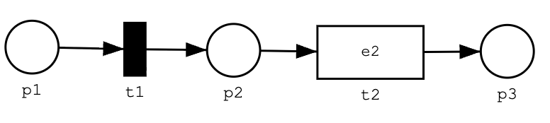
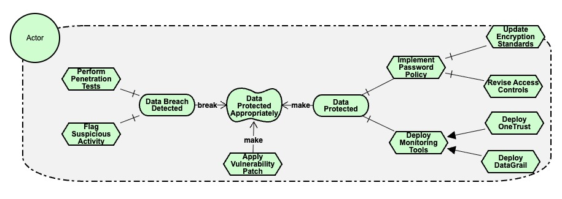
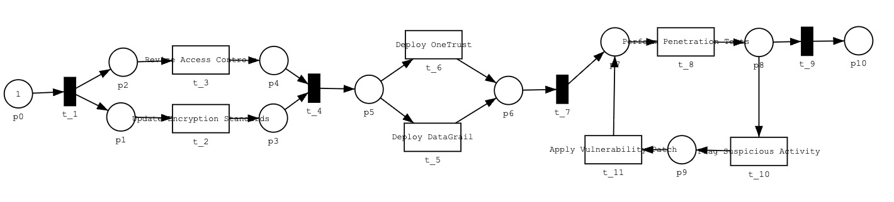
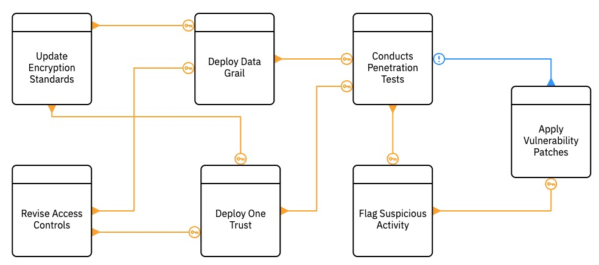
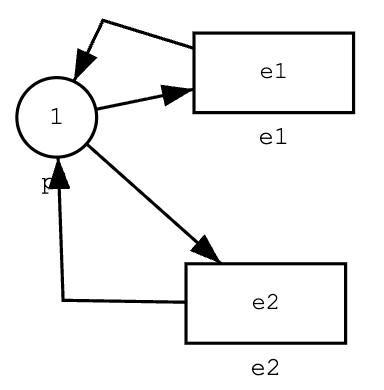

# Aligning Processes with High-Level Requirements: Goal-Model-Based Compliance Checking

## Abstract

Regulatory compliance often prioritizes adherence to explicit rules, overlooking the qualitative aspects of rule implementation. Existing goal-driven compliance approaches often focus on mapping tasks and events to enable process discovery and model repair without evaluating the qualitative factors influencing compliance goals. This study introduces a goal-driven framework that integrates requirements engineering techniques to ensure compliance at design time. It merges process and goal dimensions to validate the fulfillment of high-level compliance requirements, such as reliability, efficiency, and appropriateness. The framework involves modeling legal and business requirements as a process model, capturing compliance requirements in a goal model, and synchronizing the models to determine if the intended high-level requirements are satisfied. The framework was validated through an initial implementation, demonstrating how organizations can systematically integrate and verify both procedural and high-level compliance.

## Implementation

A prototype was developed in Python, taking as input a process model either as a Petri Net model (pnml file), a DCR Graph (xml file), or as BPMN model (bpmn file) together with the goal model (txt file). The event mapping is provided as a CSV fie. 

The tool offers three options:
- a non-interactive option. checking for stability and weak-compliance and returning either true or fals with counter examples
- an interactive option (only available for Petri nets), which allows for the animation of the combined model by executing transitions
in the process model and see the effect on the goal model. It also allows to run the algorithms for checking stability and weak-compliance and if they are not stable or not compliant, then select those states, where the validation fails.
- a second interactive option, where it is possible to animate how the goal model reacts to certain events.


### Installation
1. Required Python version 3.11
2. Clone the repository: ``git clone https://github.com/jc4v1/Kogi-Python.git``
3. Install the required packages: ``pip install -r requirements.txt``
4. You can then start Jupyter notebook with ``jupyter notebook`` and open the file README.ipynb to see this document as a Jupyter notebook and run the demo code.


## Kogi-App


Kogi-App is a simple to use interface to the Kogi tool. Here, one can select a goal model, then either a Petri Net model, a DCR graph or BPMN model, and finally the appropriate mapping of process model activities and events to intentional elements of the goal model. 

You find examples of goal models, process models and event mappings in the [Data](Data) directory of this repository.

You can provide your own models or edit the models from the [Data](Data) directory using the following editors:
- Goal Model: <a href="https://www.cin.ufpe.br/~jhcp/pistar/tool/#" target="_blank">piStar</a>
- Petri Net: <a href="https://www.fernuni-hagen.de/ilovepetrinets/fapra/wise23/rot/index.html" target="_blank">I love Petri Nets</a>
- DCR Graph: <a href="https://hugoalopez-dtu.github.io/dcr-js/" target="_blank">DCR Graph-JS</a> (download and upload as DCR Solutions XML)
- BPMN: <a href="https://bpmn.io/" target="_blank">BPMN.io</a>

Depending on wether a Petri net is uploaded or a DCR graph or BPMN model, the view switches into interactive mode (Petri net with the interactive checkbox ticked) or non-interactive mode (DCR graph and BPMN model and Petri net without the interactive checkbox ticked) plus an interactive animation of the goal model alone.

The mapping for Petri nets is optional, if the mapping can be derived from the Petri net by, e.g., adding actions the correspond to the intensional elements in the goal model for a transition in, e.g., the <a href="https://www.fernuni-hagen.de/ilovepetrinets/fapra/wise23/rot/index.html" target="_blank">I love Petri Nets</a> editor. For DCR graphs, the mapping has to be provided.

A standalone notebook for the Kogi-App is [KogiApp.ipynb](KogiApp.ipynb).

```python
# Execute the Kogi-App
from Ui.interface import FileUploadInterfaceBuilder

display(FileUploadInterfaceBuilder().create_interface())
```

## Use of Kogi in a Jupyter notebook


The remaining sections showcase the different ways the Kogi-tool can be used from within Python.


### Required imports

```python
from Semantics.istar_processor import read_istar_model
from Semantics.petri_net_processor import read_petri_net
from Semantics.dcr import read_dcr
from Semantics.event_mapping_from_csv import read_event_mapping_csv
from Ui.interface import InterfaceBuilder, WhatIfInterfaceBuilder, analyse_models
from Semantics.transition_system import CombinedTransitionSystem
```

### Non-interactive usage
1. Model the goal model using PiStar (https://www.cin.ufpe.br/~jhcp/pistar/tool/#) and download the goalModel.txt file
2. Model the process model as a Petri Net using, e.g., the "I love Petri Nets" editor (https://www.fernuni-hagen.de/ilovepetrinets/fapra/wise23/rot/index.html)
3. For the event mapping create a spreadsheet with a column for events and another for Intentional elements and save it as a CSV file.

| Event | Intentional Element |
| --- | --- |
| t1 |   |
| t2  | e2   |

The empty cell of the intentional element indicates that that specific transition is not mapped to an intentional element.
4. Alternatively, extract the event mapping from the Petri Net file. In the case for "I love Petri Nets", the transitions will be mapped to the actions defined in the editor and interpreted as intentional elements. The following Petri Net would correspond to the event mapping from before



In the following, we define a method ``analyse_models(goal_model, process_model, event_mapping)`` that takes a goal model, a process model (either Petri Net or DCR Graph) and an event mapping.
The method then follows the steps outlined in the paper.
1. In the first step, the models are translated to their respective labelled transition systems
2. Then the combined transition system is constructed from the process model, the goal model, and the event mapping
3. Then the combined system is checked for stability
4. And weak compliance. 

The results are either true or false, depending on the result of the checks and if the property does not hold, a list of traces as counter examples is returned in which the property does not hold.

The method is also available through ``from UI.interface import analyse_models``.


The following example is based on the security example, which is not stable, because we can always break the quality, but it is weak compliant, as we can always reach a state where the quality is true.

Goal Model



And Petri Net


```python
goal_model = read_istar_model("Data/security/goal_model.txt")
petri_net = read_petri_net("Data/security/petri_net.pnml")
# Map generated from the Petri Net.
event_mapping = petri_net.get_default_event_mapping()
# Alternatively the event mapping can be read from a CSV file.
# event_mapping = read_event_mapping_csv("Data/security/map.csv")

def analyse_models(goal_model, process_model, event_mapping):
    lts_gm = goal_model.as_transition_system()
    print(f"Goal Model LTS reachable states and transitions: {lts_gm.size()}")

    lts_pn = process_model.as_transition_system()
    print(f"Petri Net LTS reachable states and transitions: {lts_pn.size()}")   
    lts_combined = CombinedTransitionSystem(lts_gm, lts_pn, event_mapping)  
    print(f"Combined LTS reachable states and transitions: {lts_combined.size()}")
    print()
    
    print(f"Goal Model Goals and Tasks: {goal_model.goals_and_tasks()}")
    print(f"Goal Model Qualities: {set(goal_model.qualities.keys())}")
    print()
    print(f"Combined LTS Actions: {lts_combined.actions()}")
    print()
    print(f"Event Mapping {event_mapping}")
    print()
    
    stability = lts_combined.check_stability(goal_model.qualities)
    print(f"Stability: {stability}")

    weak_compliance = lts_combined.check_weak_compliance(goal_model.qualities)
    print(f"Weak Compliance: {weak_compliance}")
    
analyse_models(goal_model, petri_net, event_mapping)
```

Note that the number of states for the goal model, the process model, and the combined labeled transition system are shown. Note that there is no state explosion happening for the combined labeled transition system. The reason is the strong synchronization of the process model and the goal model. Each action in the process model will lead either to an intentional event in the goal model or nothing. But it is not possible for the goal model to make independent transitions from that of the process model.


#### DCR Graph Non-Interactive Use


Here is an example of running the alogrithms for the security goal model, where the process model is given as a DCR graph. Kogi works together with DCR graphs exported by https://hugoalopez-dtu.github.io/dcr-js/ as DCR Solutions XML. Note that only the basic DCR graphs are supported by the Kogi tool.



```python
goal_model = read_istar_model("Data/security/goal_model.txt")
dcr_graph = read_dcr("Data/security/dcr-graph.xml")
event_mapping = read_event_mapping_csv("Data/security/map_dcr.csv")
analyse_models(goal_model, dcr_graph, event_mapping)

```

### Interactive Usage

The following shows the interactive usage of the Kogi tool, which only works for Petri nets if the Petri net contains information about the graphical layout of places and transitions.

The following options are available in the interactive version
- One can select a transition form the Petri Net and then press on the button "execute the event" to see the effect of that transition on the goal model
- Run the stabiity check and jump to a failing state to then select a transition to see, why this state is not stable
- Run the weak compliance check and again check through animation, why weak compliance fails.

The following is the screenshot of the interactive version. In the Jupyter notebook, you can try the interactive version for yourself.


For comparision, we choose again the security example from the paper.

```python
goal_model = read_istar_model("Data/security/goal_model.txt")
petri_net = read_petri_net("Data/security/petri_net.pnml")
# Map generated from the Petri Net.
event_mapping = petri_net.get_default_event_mapping()
# Alternatively the event mapping can be read from a CSV file.
# event_mapping = read_event_mapping_csv("Data/security/map.csv")

interface = InterfaceBuilder(goal_model,petri_net=petri_net,event_mapping=event_mapping).create_interface()
display(interface)
```

### What if scenario


The what-if scenario only looks at the behaviour of the goal model, and how the goal model reacts to 
when tasks or goals are activated. In this animation, goals and tasks that don't have a
refinement, can be selected in any order. 

This allows to experiment with possible scenarios on how to achieve the goals of the 
goal model or to make or break its qualities.


The first step is to create a goal model with [PiStar](https://www.cin.ufpe.br/~jhcp/pistar/tool/#), move the file goal_model.txt in the Download folder to the right place and the right
name, and then read the file.

And then create the interface with the InterfaceBuilder class, and diplay the created interface.

```python
goal_model = read_istar_model("Data/security/goal_model.txt")

interface = WhatIfInterfaceBuilder(goal_model).create_interface()
display(interface)
```

What happens is, that in the background a Petri net is created. That Petri net 
has one place and a transition from and to that place for each task and goal that
does not have a refinement. This allows to select and execute those tasks and goals in any order.

Here is an example of the Petri net for two events e1 and e2.




## Your own example


Choose your goal model and process model. You can use the following tools
- For Goal models https://www.cin.ufpe.br/~jhcp/pistar/tool/#
- For Petri Nets https://www.fernuni-hagen.de/ilovepetrinets/fapra/wise23/rot/index.html
- For DCR Graphs https://hugoalopez-dtu.github.io/dcr-js/ (download as DCR Solutions XML)
  - Note that only the basic notation for DCR's is supported by Kogi
- The event mapping can be provided as CSV file with columns "Action" and "Intentional Element"
  - For Petri Nets, an alternative is to add intentional elements as actions to transitions in the Petri Net editor. The corresponding transitions will then be automatically mapped the intentional elements. 
  - ``event_mapping = petri_net.get_default_event_mapping()``

For Petri Nets, both, non-interactive mode and interactive mode are supported. For DCR graphs only the non-interactive mode is supported.

```python

goal_model = read_istar_model("Data/security/goal_model.txt")
process_model = read_petri_net("Data/security/petri_net.pnml")
# process_model = read_dcr("Data/security/dcr-graph.xml")

event_mapping = read_event_mapping_csv("Data/security/map.csv")
# event_mapping = process_model.get_default_event_mapping() # Alternatively, create a default mapping from a Petri Net.

analyse_models(goal_model, process_model, event_mapping)

# Only if the process model is a Petri Net:
interface = InterfaceBuilder(goal_model, process_model, event_mapping=event_mapping).create_interface()
display(interface)

```
## More Examples
More examples, including the running example and the EU air passenger rights example, can be found in the [Examples.ipynb](Examples.ipynb) Jupyter notebook and the [Data](./Data) subdirectory.


## References


- Aligning Processes with High-Level Requirements: Goal-Model-Based Compliance Checking
- High-Level Requirements-Driven Business Process Compliance

