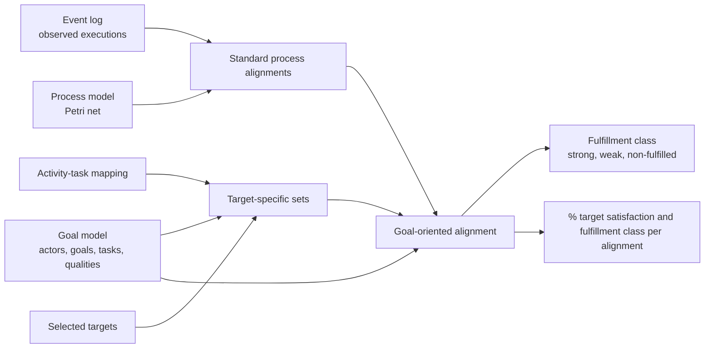
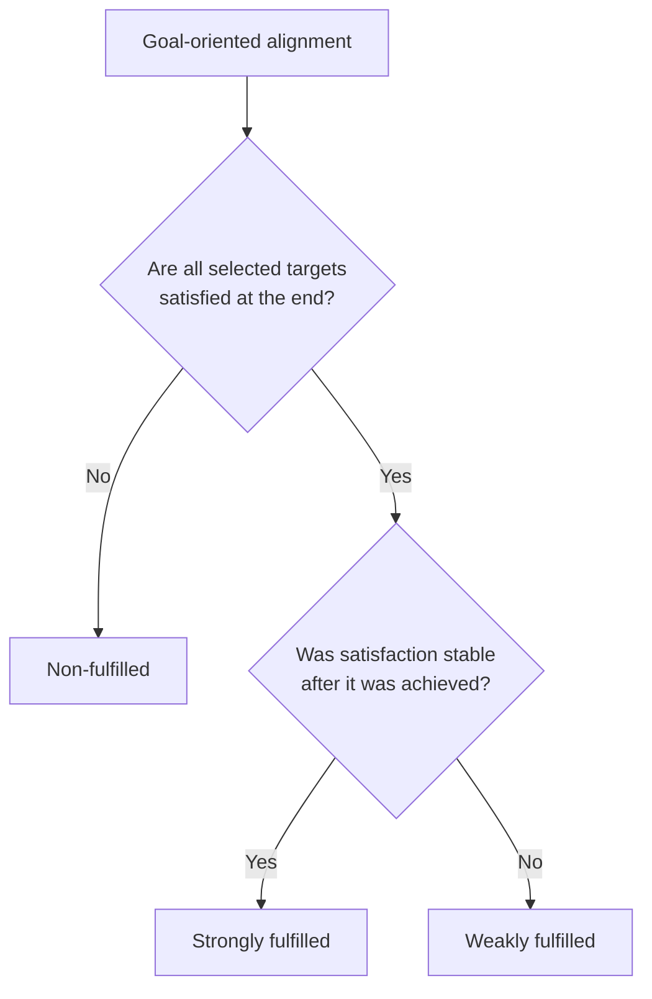
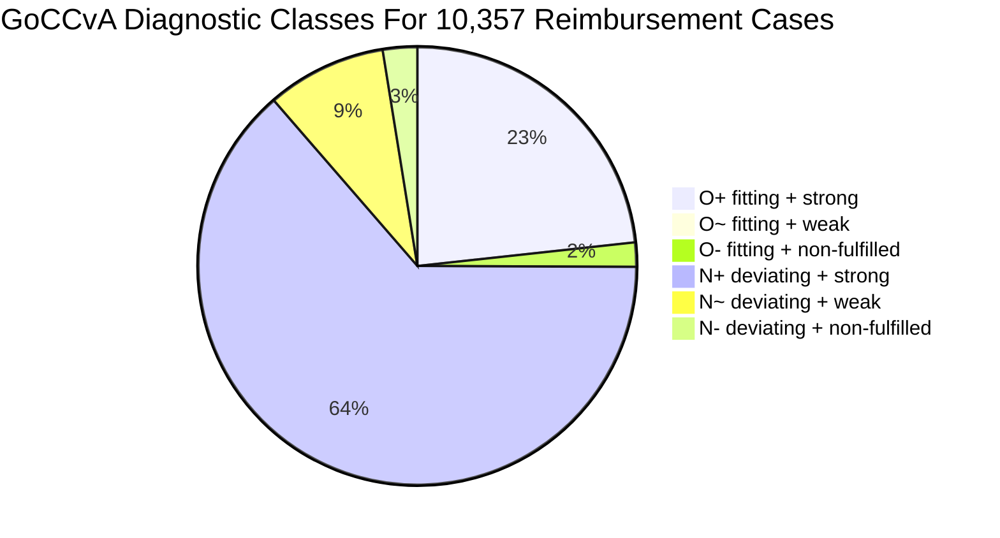

# Goal-Oriented Process Alignment


This repository contains the Python/Jupyter implementation used to explore **Goal-Oriented Conformance Checking via Alignments (GoCCvA)**. The core idea is simple: traditional alignments say whether an execution fits the process model, but GoCCvA explains whether the same execution supports, harms, or does not affect selected stakeholder goals.

The main notebook is:

[`TUE_GoCCvA_Case.ipynb`](GoCCvA/TUE_GoCCvA_Case.ipynb)

It instantiates the paper method on the **BPI Challenge 2020 domestic travel reimbursement process**, using a reimbursement goal model, Petri net process model, activity-to-goal mapping, and real event log.

## What The Paper Solves

Alignment-based conformance checking can localize deviations, but it does not explain why a deviation matters for business objectives or stakeholders. A fitting trace may fail the relevant goals, and a deviating trace may still fulfill them.

GoCCvA adds an intentional layer:



## Case Study Assets

The reimbursement notebook uses the fiues listed below:

| Input | File |
| --- | --- |
| Goal model | `work-GoCCvA-2026/content/TUEReimbursement/gm_huba_new_actor2.txt` |
| Process model | `work-GoCCvA-2026/content/TUEReimbursement/domestic_declaration_ilpn_updated.pnml` |
| Event mapping | `work-GoCCvA-2026/content/TUEReimbursement/mapping_huba_new_actor.csv` |
| Event log | `work-GoCCvA-2026/content/TUEReimbursement/DomesticDeclarations.xes.gz` |

### Goal Model


### Process Model


## Target Goals

The notebook evaluates two selected targets:

```python
targets = [
    "(Admin) adequate declaration handling",
    "(Employee) Increase employee satisfaction",
]
```

These targets are intentionally stakeholder-aware: one captures the administration perspective, while the other captures the employee perspective.


## Rendered Goal-Oriented Alignment

This is the concrete rendering that was missing from the README. It is generated from the notebook method on the representative trace:

```python
[
    "Declaration SUBMITTED by EMPLOYEE",
    "Declaration FINAL_APPROVED by SUPERVISOR",
    "Request Payment",
    "Payment Handled",
]
```


Example of a goal-oriented alignment. The process alignment is **non-optimal**: the model expects administration and budget-owner approvals that are missing from the observed log, shown as `>>` in the log row. However, the selected targets are still **strongly fulfilled** because the final goal-model marking satisfies both targets and is stable (no violation in intermediate steps)

In the table:

| Symbol | Meaning |
| --- | --- |
| `M` | The move makes/supports the selected target |
| `B` | The move breaks/harms the selected target |
| `NR` | The move is non-related to the selected target |
| `ND` | No target-specific decision is available |
| `U` | Unknown/pending target status |
| `S` | Satisfied target status |

## Event Log Snapshot

The notebook reports the following log statistics:

| Measure | Value |
| --- | ---: |
| Cases | 10,357 |
| Events | 55,628 |
| Activity classes | 14 |
| Trace variants | 90 |
| Cases with payment | 9,912, or 95.7% |
| Cases with rejection | 1,278, or 12.3% |
| Cases with resubmission | 1,006, or 9.7% |
| Cases rejected, resubmitted and paid | 967, or 75.7% of rejected cases |

## Method In The Notebook

The notebook follows the paper method in executable form:

```python
goal_model = read_istar_model("content/TUEReimbursement/gm_huba_new_actor2.txt", qualified=True)
petri_net = read_petri_net("content/TUEReimbursement/domestic_declaration_ilpn_updated.pnml")
activity_mapping = read_event_mapping_csv("content/TUEReimbursement/mapping_huba_new_actor.csv")
activity_mapping = goal_model.canonicalize_activity_mapping(activity_mapping)
```

Then it loads the BPI event log:

```python
log_file_path = "content/TUEReimbursement/DomesticDeclarations.xes.gz"
full_log = log_converter.apply(
    pm4py.read_xes(str(log_file_path)),
    variant=log_converter.Variants.TO_EVENT_LOG,
)
```

Finally, it runs GoCCvA:

```python
summary, detailed, contribution_to_targets = analyse(
    goal_model,
    petri_net,
    full_log,
    targets,
    activity_mapping,
    initial_marking=None,
)
```

## Target-Specific Meaning Of Activities

GoCCvA computes whether mapped activities make (`M`), break (`B`), or are non-related (`NR`) for each selected target.

| Target | Make set examples | Break set examples | Non-related examples |
| --- | --- | --- | --- |
| `(Admin) adequate declaration handling` | Submit declaration, approve declaration, request payment, handle payment | None in this model | Save declaration, reject declaration |
| `(Employee) Increase employee satisfaction` | Submit declaration, request payment, handle payment | Admin rejection, budget-owner rejection, supervisor rejection, employee rejection | Approval activities, save declaration |

Note: **the same event can have different meaning for different targets**. For instance, rejection is non-related to adequate declaration handling in this model, but it breaks employee satisfaction.

## Fulfillment Classes

Each goal-oriented alignment is classified using final target satisfaction and stability:



The classification is then crossed with process alignment quality:

| Code | Meaning |
| --- | --- |
| `O+` | Optimal alignment and strongly fulfilled targets |
| `O~` | Optimal alignment and weakly fulfilled targets |
| `O-` | Optimal alignment but non-fulfilled targets |
| `N+` | Non-optimal alignment but strongly fulfilled targets |
| `N~` | Non-optimal alignment but weakly fulfilled targets |
| `N-` | Non-optimal alignment and non-fulfilled targets |

## Main Result

For the full reimbursement log, the notebook obtains:

| Class | Cases | Interpretation |
| --- | ---: | --- |
| `O+` | 2,411 | Fitting and strongly fulfilled |
| `O~` | 0 | Fitting and weakly fulfilled |
| `O-` | 185 | Fitting but not fulfilled |
| `N+` | 6,584 | Deviating but strongly fulfilled |
| `N~` | 914 | Deviating but weakly fulfilled |
| `N-` | 263 | Deviating and not fulfilled |



The key finding is that **behavioral conformance and goal fulfillment diverge**:

| Finding | Value |
| --- | ---: |
| Optimal process alignments | 2,596 cases, or 25.1% |
| Non-optimal process alignments | 7,761 cases, or 74.9% |
| Optimal but non-fulfilled | 185 cases, or 7.1% of optimal cases |
| Non-optimal but fulfilled | 7,498 cases, or 96.6% of non-optimal cases |

This is exactly why the paper needs GoCCvA: a process deviation is not automatically a goal failure, and a fitting execution is not automatically a stakeholder success.

## Example Trace Queries

The notebook includes concrete trace filtering to inspect the results.

Find traces that fulfill employee satisfaction, either strongly or weakly:

```python
trace_filter = TraceFilter(goal_model, traces, activity_mapping)

employee_satisfied_traces = (
    trace_filter
    .query()
    .where("(Employee) Increase employee satisfaction", ComplianceStatus.COMPLIANT)
    .traces()
)
```

Result:

| Query | Result |
| --- | ---: |
| Employee satisfaction compliant traces | 9,909 |
| Percentage of all traces | 95.67% |
| Non-compliant traces | 4.33% |

Find payment cases without a submitted declaration:

```python
payment_but_no_declaration_submitted = (
    trace_filter
    .query()
    .contains("Payment Handled")
    .not_contains("Declaration SUBMITTED by EMPLOYEE")
    .sort_by_length()
    .traces()
)
```

The notebook finds one trace:

```python
[
    "Declaration SAVED by EMPLOYEE",
    "Request Payment",
    "Payment Handled",
]
```

Find paid traces that do not satisfy employee satisfaction:

```python
no_satisfaction_but_paid = (
    trace_filter
    .query()
    .where("(Employee) Increase employee satisfaction", ComplianceStatus.NON_COMPLIANT)
    .contains("Payment Handled")
    .sort_by_length()
    .traces()
)
```

The notebook finds three such traces. These are concrete examples where payment completion alone is not enough to claim stakeholder goal fulfillment.


## Repository Map

| Path | Purpose |
| --- | --- |
| `Semantics/goccva_pipeline.py` | Core GoCCvA analysis: alignment enrichment and fulfillment classification |
| `Semantics/target_sets.py` | Computes make, break, and non-related sets |
| `Semantics/label_assignment.py` | Labels alignment moves as `M`, `B`, `NR`, or `ND` |
| `Semantics/goccva_filter.py` | Trace filtering DSL used in the notebook |
| `Ui/goccva_ui.py` | Rendering functions for matrices and goal-oriented alignment examples |
| `content/TUEReimbursement/` | Reimbursement case-study models, mapping, figures, and log |
| `tests/` | Regression and semantic tests |

## Run It

Use Python 3.11. From the repository root:

```bash
pip install pandas pm4py ipywidgets jupyter pytest
jupyter notebook
```

Open:

```text
work-GoCCvA-2026\TUE_GoCCvA_Case.ipynb
```

To run tests:

```bash
pytest
```

## Takeaways

GoCCvA turns a process alignment from "where did the trace fit or deviate?" into "how did each aligned move affect the selected goals, qualities, and actor concerns, and did the execution ultimately fulfill them?"
